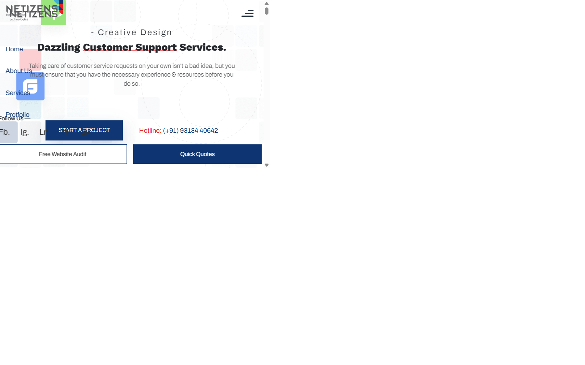

# Netizens Technologies Website



Netizens Technologies is a responsive digital agency website concept. It presents the agency's services, work, development process, technology capabilities, testimonials, and career opportunities in a visual single-page experience.

## Pages

- `index.html` - Main agency homepage with hero slider, services, portfolio, process, technology, testimonials, and contact sections.
- `career.html` - Career and current openings page using the same brand navigation and visual system.

## Technologies Used

- HTML5 for the page structure and content
- SCSS and CSS for responsive styling and layout
- JavaScript with jQuery for interactions
- Bootstrap for responsive grid and UI utilities
- Swiper for content sliders
- GSAP and ScrollTrigger for animation and scroll effects
- Locomotive Scroll for smooth scrolling
- Splitting.js for animated text treatment
- Odometer for animated counters
- Google Fonts (Work Sans)

## Run Locally

This is a static website, so no build step is required.

1. Clone the repository.
2. Open `index.html` directly in a browser, or serve the folder with a local static server.
3. Open `career.html` to view the careers page.

For example, with VS Code, install the **Live Server** extension and choose **Open with Live Server** on `index.html`.

## Project Structure

```text
.
├── index.html
├── career.html
├── assets/
│   ├── css/       # Compiled styles and vendor CSS
│   └── images/    # Logos, icons, portfolio, and technology imagery
├── js/            # Vendor JavaScript and site interactions
└── scss/          # Source SCSS files
```

## Preview

The screenshot above shows the homepage hero section at desktop size. The layout is responsive and includes a mobile navigation menu for smaller screens.